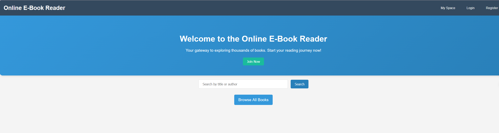
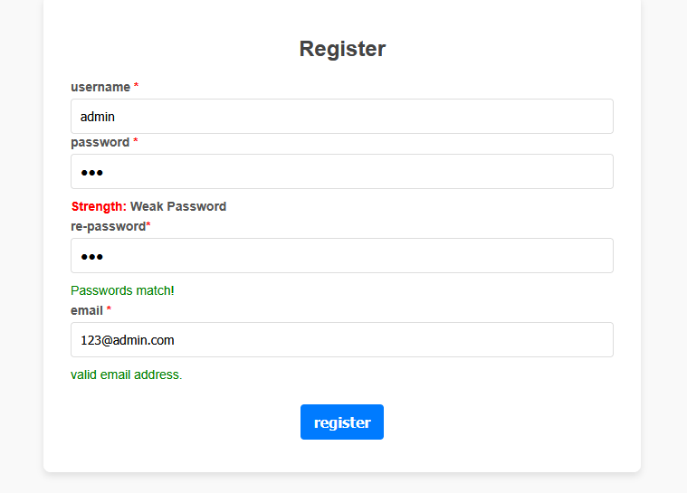
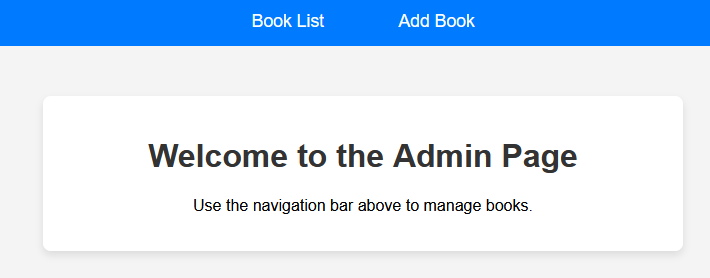

# Online E-Book Reader

A full-stack **Java Servlet + JSP** web application for browsing, searching, and reading e-books in the browser. Designed and implemented as a solo project.

## Features

- **User accounts** — registration, login (SHA-256 hashed passwords), profile reset, account deletion
- **Book catalog** — paginated listing, search by title, book detail pages
- **In-browser reading** — PDF rendering with [PDF.js](https://mozilla.github.io/pdf.js/) (page navigation and jump-to-page)
- **Bookmarks** — save and manage favorite books per user
- **Admin panel** — CRUD for books (admin user only)
- **Access control** — `LoginFilter` for authenticated routes; `AdminFilter` for admin pages

## Screenshots

| Home | Reader | Admin |
|------|--------|-------|
|  |  |  |

## Tech Stack

| Layer | Technologies |
|-------|----------------|
| Backend | Java, Servlet 4, Filter |
| View | JSP, JSTL |
| Data | MySQL, C3P0 connection pool, Apache Commons DBUtils |
| Client | HTML/CSS, JavaScript, CryptoJS (password hashing), PDF.js |
| IDE / Server | IntelliJ IDEA, Apache Tomcat |

## Architecture

```
Browser (JSP + JS)
       ↓
Servlet (Controller)  ←  LoginFilter / AdminFilter
       ↓
Service
       ↓
DAO (DBUtils + C3P0)
       ↓
MySQL
```

## Database Schema

Tables: `user`, `book`, `bookmark`, `reading_history` (schema defined; reading-history UI not implemented).

Initialize with:

```bash
mysql -u root -p < mysql.sql
```

Create a database (e.g. `jdbc`) and ensure it matches your C3P0 settings in `src/c3p0-config.xml`.

## Prerequisites

- JDK 23 (or the version your Tomcat supports)
- Apache Tomcat 8+
- MySQL 5.7+ / 8.x
- IntelliJ IDEA (recommended) or another Java EE–capable IDE

## Getting Started

### 1. Clone the repository

```bash
git clone https://github.com/ccpppyja/online-E-book-reading-web-system---old-version.git
cd online-E-book-reading-web-system---old-version
```

### 2. Configure the database

1. Create a MySQL database (default in config: `jdbc`).
2. Run `mysql.sql` to create tables.
3. Update `src/c3p0-config.xml` with your JDBC URL, username, and password.

> **Do not commit real credentials.** Use local config or environment-specific overrides.

### 3. Add dependencies

Place required JARs under `web/WEB-INF/lib/` (this folder is gitignored). Typical libraries:

- MySQL Connector/J
- c3p0
- Apache Commons DBUtils
- JSTL (+ standard taglib implementation)
- Servlet API (provided by Tomcat at runtime)

### 4. Book assets (optional)

- PDF files and cover images are referenced by URL fields in the `book` table (`fileUrl`, `imageUrl`).
- Local folders `web/books/` and `web/images/` are gitignored; add your own assets when testing.

### 5. Deploy

1. Open the project in IntelliJ IDEA.
2. Configure an **Artifact** (WAR) and a Tomcat run configuration.
3. Build and run; open e.g. `http://localhost:8080/<context-path>/home.jsp`.

### 6. Admin access

The admin role is determined by username **`admin`**. Create that user via registration or insert manually in the `user` table before using the admin panel (`admin_page.jsp`).

## Main Routes

| Path | Description |
|------|-------------|
| `/home.jsp` | Public landing page |
| `/login`, `/register` | Authentication |
| `/all_books` | Paginated book list |
| `/BookSearchServlet` | Search by keyword |
| `/book_details` | Book details |
| `/book_reading` | PDF reader |
| `/add_bookmarks`, `/list_bookmarks` | Bookmarks |
| `/books_list`, `/add_book` | Admin book management |

## Project Structure

```
├── mysql.sql                 # Database DDL
├── src/
│   ├── c3p0-config.xml       # Data source configuration
│   └── s108122020015/
│       ├── controller/       # Servlets & filters
│       ├── service/          # Business logic
│       ├── dao/              # Data access
│       ├── model/            # Entities
│       └── utils/
└── web/                      # JSP views & static resources
```

## Security Notes

- Passwords are hashed with **SHA-256** on the client (CryptoJS) and verified on the server; registration applies an additional server-side hash.
- Admin authorization is based on the fixed username `admin`.
- For production use, prefer **HTTPS**, **bcrypt/argon2** server-side hashing, and role-based access control instead of username checks.

## Known Limitations

- `reading_history` table exists but has no implemented backend/UI yet.
- Bookmark duplicate checks should be per `(userId, bookId)`; review before production use.

## Author

**chen jinlong** — solo design and implementation.

## License

This project is for educational purposes.
